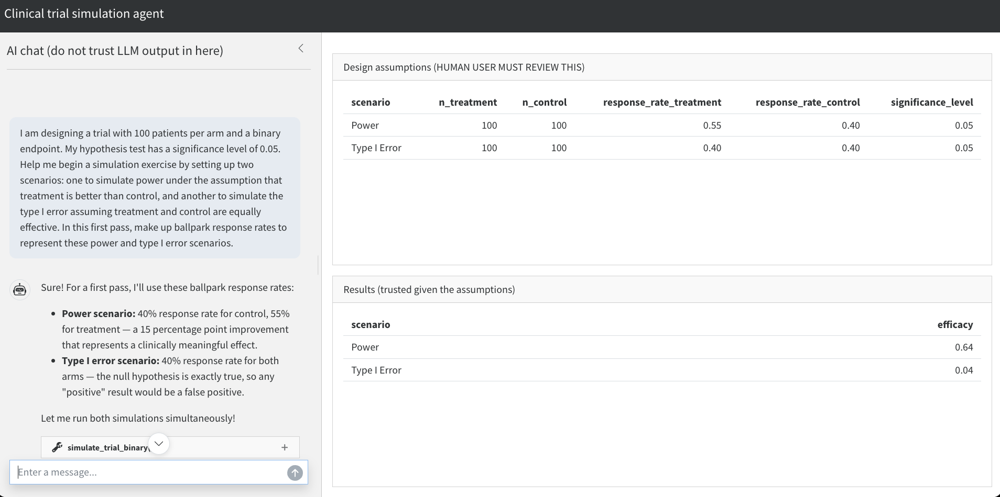

## Abide by the Rules {terminal-path="introduction"}

::: callouts

- Trusted tools directly produce all results.
- Each result only comes from one trusted tool.
- Inputs to trusted tools have trusted human oversight.

:::

## Workflow {terminal-path="introduction"}

::: {#fig-workflow}

```{mermaid}
%%{init: {'theme':'base', 'themeVariables': {'lineColor':'#4B5563','edgeLabelBackground':'#ffffff'}}}%%
flowchart LR
    subgraph AgentLoop["Agent Loop"]
        direction TB
        Model["Model"]
        UT["Untrusted<br>Tools"]
        Model -->|"Autonomous<br>reasoning"| UT
        UT --> Model
    end

    HR["Human<br>Review"]

    subgraph Trust["Trust"]
        direction TB
        TT["Trusted<br>Tools"]
        TR["Trusted<br>Results"]
        TT -->|"Nontrivial<br>Computation"| TR
    end

    AgentLoop -->|"Proposed Inputs"| HR
    HR -->|"Rejected Proposals"| AgentLoop
    HR -->|"Reviewed Inputs"| TT

    style Model fill:#1F3A63,color:#ffffff,stroke:#1F3A63
    style UT fill:#6B2020,color:#ffffff,stroke:#6B2020
    style HR fill:#166534,color:#ffffff,stroke:#166534
    style TT fill:#166534,color:#ffffff,stroke:#166534
    style TR fill:#166534,color:#ffffff,stroke:#166534
    style AgentLoop fill:#FDE8E8,stroke:#9CA3AF
    style Trust fill:#F3F4F6,stroke:#9CA3AF
```

Flow diagram of a trusted mini-agent. 
:::

## Application: Clinical Trial Simulation {terminal-path="use-case"}

::: {.columns}

::: {.column width="50%"}

{.absolute height="62%"}

:::

::: {.column width="50%"}

::: callouts

- Bypass the AI model to generate simulation results
- Never bypass simulation tools (functions, packages, etc)
- Transparent display of input parameters generated by AI model

:::

:::

:::

## A Case for Shiny (and friends) {terminal-path="template-structure"}


## Ingredients {terminal-path="template-structure"}

::: callouts

- User interface powered by `{shinychat}`
- {ellmer} chat object with declared tools
- R functions serving as foundation for tools
- `reactiveValues` storing results of tool calls 

:::

## Demo Time! {terminal-path="demo"}



## Resources

::: callouts

- Trusted Mini-Agents guide: [trustedminiagents.dev](https://trustedminiagents.dev)
- {ellmer}: [ellmer.tidyverse.org/](https://ellmer.tidyverse.org/)
- {shinychat}: [posit-dev.github.io/shinychat](https://posit-dev.github.io/shinychat)
:::

